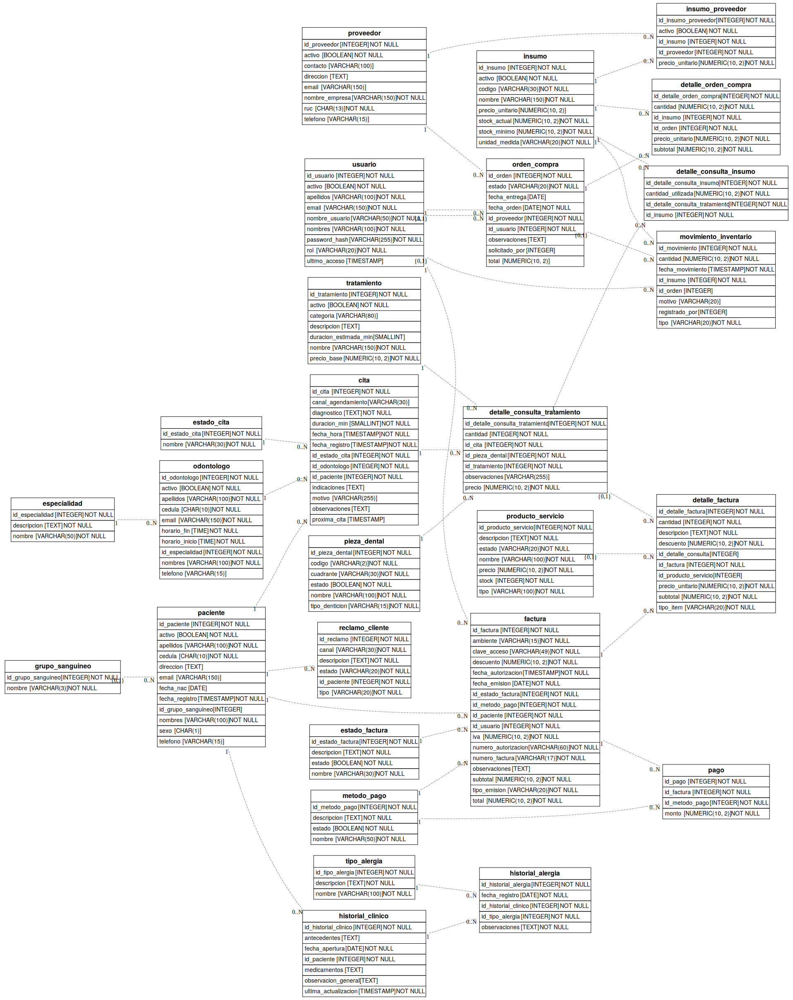

<div align="center">
🦷 SGCO — Sistema de Gestión de Clínica Odontológica
Relational database design & implementation for a dental clinic management system.


[]()

English Summary • Descripción en Español • Repository Contents
</div>
---
🇬🇧 English Summary
Role: Technical Lead / Database Architect · Team of 4 · University coursework (Relational Database Fundamentals, UTEQ)
I led the design and implementation of a relational database for a mid-sized dental clinic in Guayaquil, Ecuador — managing patients, appointments, treatments, billing, payments, inventory, and customer complaints.
Highlights
🗄️ 27-table relational schema, normalized to Third Normal Form (3NF), spanning clinical, financial, and inventory modules.
🔗 Modeled an N:N relationship for patient allergy tracking and a polymorphic invoice-line design (`detalle_factura`), constrained with a `CHECK` clause so each line references either a treatment or a product/service — never both.
🇪🇨 Added Ecuadorian e-invoicing (SRI) fields to the billing module, based on instructor feedback on the ER diagram.
💰 Used `numeric(10,2)` for every monetary field, avoiding floating-point rounding errors in billing and payments.
🧾 Wrote a pgAdmin-native master SQL script (explicit `CREATE DATABASE`, sequences, referential-integrity constraints, `CHECK` domain constraints, unique keys), validated against ~100 records per core transactional table.
📊 Authored and validated 40 SQL queries — multi-table joins, `GROUP BY` aggregations, subqueries, and compound filters — answering real business questions for clinic administration, billing, and inventory.
Stack: PostgreSQL 18 · SQL (DDL/DML) · Graphviz (ER diagram)
---
🇪🇨 Descripción (Español)
Sistema de Gestión para Clínica Odontológica (SGCO), diseñado para una clínica privada de tamaño mediano en Guayaquil, Ecuador, con una cartera aproximada de +100 pacientes activos. Centraliza el registro de pacientes, historias clínicas, citas, tratamientos, facturación, pagos, reclamos e inventario de insumos.
Mi rol: Líder técnico y arquitecto de base de datos del proyecto grupal (4 integrantes).
Aspectos técnicos destacados
#	Decisión de diseño	Por qué importa
1	27 tablas normalizadas hasta 3FN, en módulos clínico, financiero e inventario	Evita redundancia e inconsistencias de datos
2	Relación N:N para alergias de pacientes (`historial_alergia`)	Un paciente puede tener múltiples alergias, y cada tipo aplica a múltiples pacientes
3	Diseño polimórfico en `detalle_factura` con restricción `CHECK` (`chk_detalle_factura_tipo_item`)	Una factura referencia un tratamiento o un producto/servicio, nunca ambos, sin duplicar tablas
4	Campos de facturación electrónica SRI Ecuador	Cumple con requisitos fiscales reales del país
5	`numeric(10,2)` en todo campo monetario	Elimina errores de redondeo de punto flotante en facturación
6	Tablas intermedias con atributos propios (`detalle_factura`, `detalle_orden_compra`, `insumo_proveedor`)	Conserva el precio histórico de venta/compra aunque cambie el catálogo
🔍 Limitación identificada
El sistema no cuenta con un mecanismo uniforme de auditoría o baja lógica: algunas tablas tienen columna `activo`/`estado` y otras no, lo que impide desactivar un insumo o proveedor sin eliminarlo físicamente. Una versión futura podría estandarizar columnas de auditoría (`activo`, `fecha_creacion`, `creado_por`) en todas las tablas transaccionales.
---
📂 Repository Contents
```
sgco-clinica-odontologica/
├── database/
│   └── script_maestro_sgco.sql    # Full schema (27 tables) + seed data + verification queries
└── diagrams/
    ├── diagrama_sgco.svg          # Complete ER diagram (vector)
    └── diagrama_sgco.png          # Complete ER diagram (preview)
```
File	Description
`database/script_maestro_sgco.sql`	Full schema (27 tables), seed data, and 5+ verification queries
`diagrams/diagrama_sgco.svg`	Complete entity-relationship diagram
<details>
<summary><strong>📐 View ER Diagram Preview</strong></summary>
<br>

</details>
---
<div align="center">
Byron Almeida Coello
LinkedIn · Relational Database Fundamentals — UTEQ, 2026
</div>
